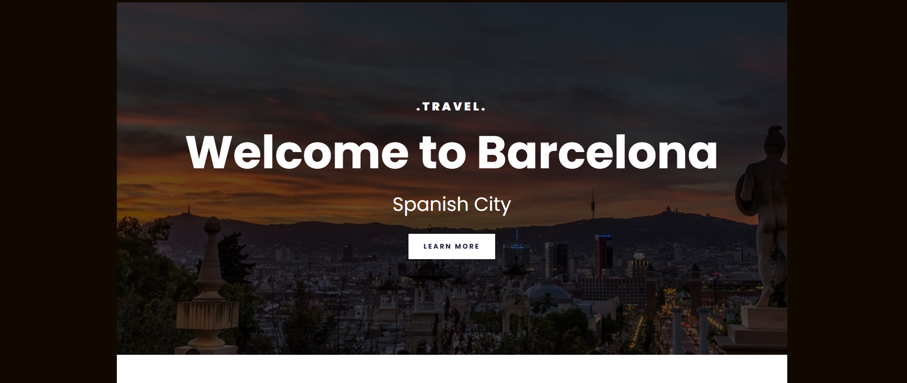
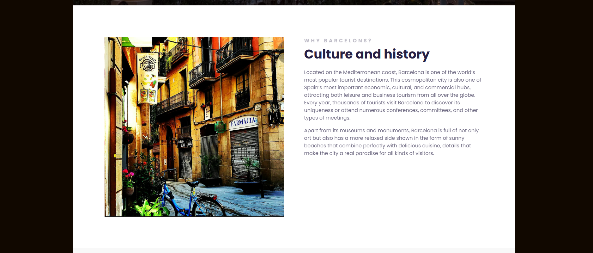
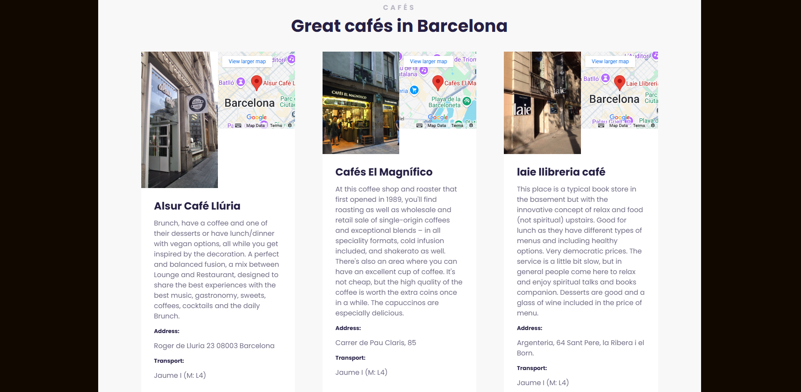
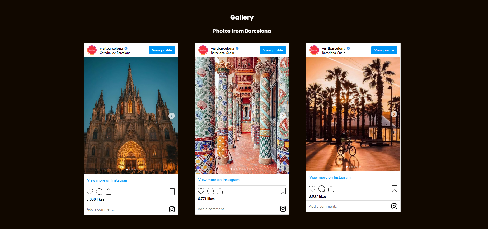
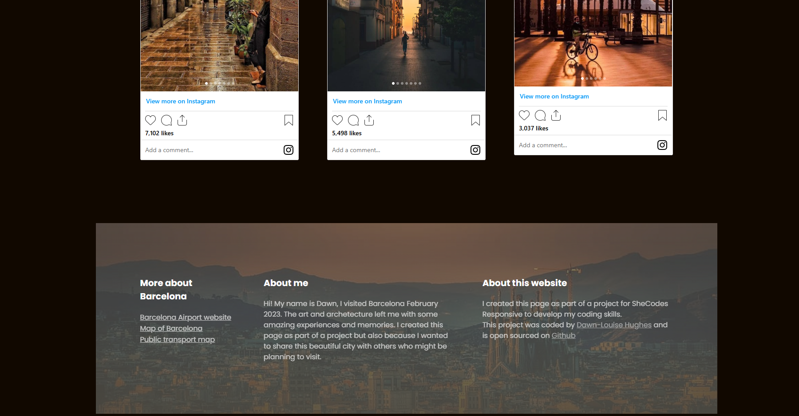

## Barcelona Travel Website
The Barcelona Travel Website was created as a passion project after I visited Barcelona and fell in love with the city. During my trip, I was captivated by the vibrant culture, stunning architecture, and incredible experiences I had. Inspired by my journey, I decided to build this site to share my personal recommendations and experiences with others.

The site includes the places I visited, such as iconic landmarks, hidden gems, and my favorite spots for dining and relaxation. Additionally, I've incorporated pictures I personally took during my trip, allowing visitors to explore the beauty of Barcelona through my lens. It’s my way of bringing a piece of this unforgettable city to others who may be planning to visit or simply want to experience it virtually.

## Preview

## Key Features
- Responsive Layout: The site adapts to different screen sizes using responsive design techniques.
- Tourist Information: Basic tourist information aabout the city.
- Local Tips: Offers advice for travelers, such as the best time to visit and how to get around the city.
- Cafe Recommendations: A list of top spots featuring personal favs from my trip.
- Interactive Map: Displays an embeded interactive map of Barcelona to the side of the Cafe to help users locate the suggested cafe.
- Image Gallery: Showcases high-quality embeded images of Barcelona from the officail Visit Barcelona Instagram page, allowing visitors to view the beauty of the city.
- Footer links: Connects to Airport information, City information and transport information
- 
## Tech Used
- HTML: Used for structuring the content of the website, including text, images, and links.
- CSS: Employed for styling the website to give it a clean, modern look. It includes layouts, typography, colors, and hover effects.
- Flexbox and Grid layouts for responsive design.
- Media queries for adapting the layout to different screen sizes.
- Custom styles for buttons, navigation, and sections.

## Embedded Content:
- Embedded Instagram pictures to display information from live instagram site
- Google Maps embedding to display an interactive map.

## What I’ve Learned

# HTML
- How to structure a webpage with appropriate use of tags, using 'header', 'footer', and 'sections'.
- Embedding media like instagram and google maps using the <iframe> element.

# CSS
- Using Flexbox for building flexible layouts.
- Leveraging CSS Grid for two-dimensional layouts, like the gallery section.
- Applying custom fonts and typography to improve readability.
- Working with pseudo-classes (:hover, :active) to enhance user experience.
- Using media queries to ensure the site is fully responsive across devices.

## Installation
Clone the repository:
https://github.com/FedDawb/Travel-Site

## Live Demo
https://travelbarcelona2024.netlify.app/

## Features to Add for Improvement
Here are some suggestions on what I would implement next to improve the project:

- Interactive Itinerary Planner: Allow users to create and customize their travel itineraries.
- User Authentication: Implement user registration and login to save travel preferences and itineraries.
- Weather Widget: Add a live weather widget showing the current weather in Barcelona.
- Language Support: Include language options, such as English and Spanish, to cater to a wider audience.
- SEO Optimization: Ensure proper meta tags, descriptions, and title attributes to improve search engine ranking.
- Accessibility Improvements: Implement keyboard navigation and use ARIA attributes to ensure the site is accessible to all users.
- Booking Integration: Add booking options for hotels and flights, possibly using a third-party API.

